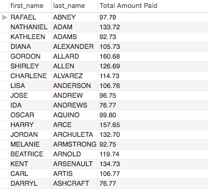

## Homework Assignment

* 1a. Display the first and last names of all actors from the table `actor`. 

SELECT first_name, last_name
FROM actor;

* 1b. Display the first and last name of each actor in a single column in upper case letters. Name the column `Actor Name`. 

SELECT CONCAT(UPPER(first_name)," ",UPPER(last_name)) 
AS 'actor name'
FROM actor;

* 2a. You need to find the ID number, first name, and last name of an actor, of whom you know only the first name, "Joe." What is one query would you use to obtain this information?

SELECT actor_id,first_name,last_name
FROM actor
WHERE first_name LIKE 'Joe';
  	
* 2b. Find all actors whose last name contain the letters `GEN`:
  	
SELECT first_name,last_name
FROM actor 
WHERE last_name LIKE '%Gen%';

* 2c. Find all actors whose last names contain the letters `LI`. This time, order the rows by last name and first name, in that order:

SELECT last_name,first_name
FROM actor
WHERE last_name LIKE '%LI%';

* 2d. Using `IN`, display the `country_id` and `country` columns of the following countries: Afghanistan, Bangladesh, and China:

SELECT country_id, country
FROM country 
WHERE country IN (
    'Afghanistan', 'Bangladesh', 'China'
    );

* 3a. Add a `middle_name` column to the table `actor`. Position it between `first_name` and `last_name`. Hint: you will need to specify the data type.

ALTER TABLE actor 
ADD middle_name VARCHAR(255)
AFTER first_name;
SELECT * FROM actor; 

* 3b. You realize that some of these actors have tremendously long last names. Change the data type of the `middle_name` column to `blobs`.

ALTER TABLE actor 
MODIFY middle_name BLOB; 

* 3c. Now delete the `middle_name` column.

ALTER TABLE actor 
DROP COLUMN middle_name;

* 4a. List the last names of actors, as well as how many actors have that last name.

SELECT last_name, COUNT(*) AS 'Count'
FROM actor 
GROUP BY last_name
ORDER BY COUNT(*) DESC;

* 4b. List last names of actors and the number of actors who have that last name, but only for names that are shared by at least two actors

SELECT last_name, COUNT(*) AS 'Count'
FROM actor 
GROUP BY last_name
HAVING COUNT(*) >= 2
ORDER BY COUNT(*) DESC;
  	
* 4c. Oh, no! The actor `HARPO WILLIAMS` was accidentally entered in the `actor` table as `GROUCHO WILLIAMS`, the name of Harpo's second cousin's husband's yoga teacher. Write a query to fix the record.

UPDATE actor 
SET first_name = 'HARPO'
WHERE first_name = 'GROUCHO' AND last_name = 'WILLIAMS';
  	
* 4d. Perhaps we were too hasty in changing `GROUCHO` to `HARPO`. It turns out that `GROUCHO` was the correct name after all! In a single query, if the first name of the actor is currently `HARPO`, change it to `GROUCHO`. Otherwise, change the first name to `MUCHO GROUCHO`, as that is exactly what the actor will be with the grievous error. BE CAREFUL NOT TO CHANGE THE FIRST NAME OF EVERY ACTOR TO `MUCHO GROUCHO`, HOWEVER! (Hint: update the record using a unique identifier.)

UPDATE actor 
SET first_name = 'GROUCHO'
WHERE first_name = 'HARPO';

* 5a. You cannot locate the schema of the `address` table. Which query would you use to re-create it?

DESCRIBE sakila.address;
SHOW CREATE TABLE address; 

* 6a. Use `JOIN` to display the first and last names, as well as the address, of each staff member. Use the tables `staff` and `address`:

SELECT a.first_name, a.last_name, b.address
FROM staff a
LEFT JOIN address b
ON a.address_id = b.address_id;

* 6b. Use `JOIN` to display the total amount rung up by each staff member in August of 2005. Use tables `staff` and `payment`. 

SELECT payment.staff_id, staff.first_name, staff.last_name, SUM(payment.amount) AS 'Total_Amount', payment.payment_date 
FROM staff 
JOIN payment
ON staff.staff_id = payment.staff_id
WHERE payment.payment_date LIKE '2005-08%'
GROUP BY staff_id;  
  	
* 6c. List each film and the number of actors who are listed for that film. Use tables `film_actor` and `film`. Use inner join.
  	
SELECT b.title, COUNT(a.actor_id) AS 'Actor_Count'
FROM film b
INNER JOIN film_actor a
ON a.film_id = b.film_id
GROUP BY b.film_id
ORDER BY COUNT(a.actor_id) DESC;

* 6d. How many copies of the film `Hunchback Impossible` exist in the inventory system?

SELECT COUNT(inventory_id)
FROM inventory 
WHERE film_id IN
(
	SELECT film_id
    FROM film
    WHERE title = 'Hunchback Impossible'
);

* 6e. Using the tables `payment` and `customer` and the `JOIN` command, list the total paid by each customer. List the customers alphabetically by last name:

  ```
  	
  ```
SELECT a.first_name, a.last_name, SUM(b.amount) AS 'Total Amount Paid'
FROM customer a
INNER JOIN payment b
ON a.customer_id = b.customer_id
GROUP BY b.customer_id
ORDER BY a.last_name ASC;

* 7a. The music of Queen and Kris Kristofferson have seen an unlikely resurgence. As an unintended consequence, films starting with the letters `K` and `Q` have also soared in popularity. Use subqueries to display the titles of movies starting with the letters `K` and `Q` whose language is English. 

SELECT film.title, language.name 
FROM film
JOIN language
ON film.language_id = language.language_id
WHERE (film.title LIKE 'Q%' OR film.title LIKE 'K%') AND language.name = 'English';

* 7b. Use subqueries to display all actors who appear in the film `Alone Trip`.

SELECT first_name, last_name
FROM actor
WHERE actor_id IN
(
	SELECT actor_id
    FROM film_actor
    WHERE film_id IN
    (
		SELECT film_id
        FROM film
        WHERE title = 'Alone Trip'
    )
);

SELECT actor.first_name, actor.last_name, film.title
FROM actor 
JOIN film_actor ON actor.actor_id = film_actor.actor_id
JOIN film ON film.film_id = film_actor.film_id
WHERE film.title = 'Alone Trip';
   
* 7c. You want to run an email marketing campaign in Canada, for which you will need the names and email addresses of all Canadian customers. Use joins to retrieve this information.

SELECT first_name, last_name, email 
FROM customer
WHERE address_id IN
(
	SELECT address_id
    FROM address
    WHERE city_id IN
    (
		SELECT city_id
		FROM city
		WHERE country_id IN
        (
			SELECT country_id
            FROM country
            WHERE country = 'Canada'
        )
    )
);

SELECT customer.first_name, customer.last_name, customer.email
FROM customer 
JOIN address ON customer.address_id = address.address_id 
JOIN city ON address.city_id = city.city_id 
JOIN country ON city.country_id = country.country_id
WHERE country like 'Canada';

* 7d. Sales have been lagging among young families, and you wish to target all family movies for a promotion. Identify all movies categorized as famiLy films.

SELECT title
 FROM film 
 WHERE film_id IN
 (
	SELECT film_id
    FROM film_category
    WHERE category_id IN
    (
		SELECT category_id
        FROM category
        WHERE name = 'family'
    )
 );

 SELECT a.title, c.name
 FROM film AS a
 JOIN film_category AS b ON a.film_id = b.film_id
 JOIN category AS c ON b.category_id = c.category_id
 WHERE c.name = 'family';

* 7e. Display the most frequently rented movies in descending order.
  	
SELECT film.title, COUNT(rental.rental_date) AS total_count
FROM film 
JOIN inventory 
ON film.film_id = inventory.film_id 
JOIN rental 
ON inventory.inventory_id = rental.inventory_id
GROUP BY film.title 
ORDER BY COUNT(rental.rental_date) DESC;

* 7f. Write a query to display how much business, in dollars, each store brought in.

SELECT * FROM sales_by_store;

* 7g. Write a query to display for each store its store ID, city, and country.

SELECT store.store_id, city.city, country.country
FROM store
JOIN address ON store.address_id = address.address_id
JOIN city ON address.city_id = city.city_id
JOIN country ON city.country_id = country.country_id;
  	
* 7h. List the top five genres in gross revenue in descending order. (**Hint**: you may need to use the following tables: category, film_category, inventory, payment, and rental.)

SELECT * FROM sales_by_film_category
ORDER BY total_sales DESC LIMIT 5;
  	
* 8a. In your new role as an executive, you would like to have an easy way of viewing the Top five genres by gross revenue. Use the solution from the problem above to create a view. If you haven't solved 7h, you can substitute another query to create a view.
  	
CREATE VIEW sales_by_film_category 
AS 
SELECT c.name AS category, SUM(p.amount) AS total_sales
FROM payment AS p
INNER JOIN rental AS r ON p.rental_id = r.rental_id
INNER JOIN inventory AS i ON r.inventory_id = i.inventory_id
INNER JOIN film AS f ON i.film_id = f.film_id
INNER JOIN film_category AS fc ON f.film_id = fc.film_id
INNER JOIN category AS c ON fc.category_id = c.category_id
GROUP BY c.name
ORDER BY total_sales DESC LIMIT 5;


* 8b. How would you display the view that you created in 8a?

SELECT * FROM sales_by_film_category;


* 8c. You find that you no longer need the view `top_five_genres`. Write a query to delete it.

DROP VIEW sales_by_film_category;


### Appendix: List of Tables in the Sakila DB

* A schema is also available as `sakila_schema.svg`. Open it with a browser to view.

```sql
	'actor'
	'actor_info'
	'address'
	'category'
	'city'
	'country'
	'customer'
	'customer_list'
	'film'
	'film_actor'
	'film_category'
	'film_list'
	'film_text'
	'inventory'
	'language'
	'nicer_but_slower_film_list'
	'payment'
	'rental'
	'sales_by_film_category'
	'sales_by_store'
	'staff'
	'staff_list'
	'store'
```
